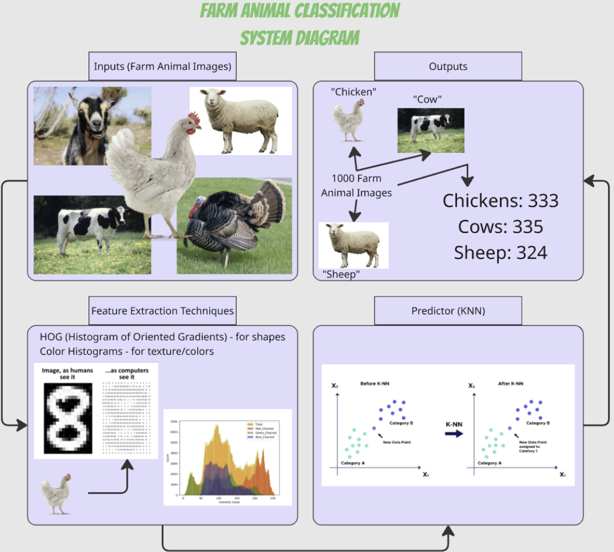

# CMPT 310 Group Project - Farm Animal Classification System
Our project idea is to train and develop an AI system that can correctly identify some common farm animals. This is technology that could potentially be useful to farmers who need automated livestock inventory and transit tracking. Picture this: you’re an owner of a large commercial farm in British Columbia. Every time a truckload of animals arrive, you need to count and sort the animals. Normally, a human worker would have to count and sort the animals manually. This method of counting is subject to human error and takes a long time as well. Instead of a farmworker manually counting every individual animal, we can install an overhead security camera over the unloading ramps to capture live feeds of incoming animals, feeding the frames into our AI system. Then, the system can automatically increment the number of animals for each type. Obviously, machine error will still exist, but we hope to minimize them. Implementing this system on an actual security camera is out of the scope of our project and this course. We will only be designing and training our system to identify farm animals based on images. Nonetheless, this scenario demonstrates how our system could theoretically be expanded upon to work in more practical applications such as the aforementioned scenario. 

## Inputs
Images of animals (cows, pigs, chickens, sheep, goats, turkeys, etc). 

## Outputs
Animal label (what kind of animal is depicted in this image?).
Tally of each animal type (ex. given 1000 images of animals, how many are cows? pigs? chickens?)

## Minimum Viable System 
The simplest working version of our system is to be able to interpret images of farm animals and to classify them through the K-Nearest Neighbours algorithm. We will start by limiting the classifications to just cows, pigs, chickens, sheep, goats, and turkeys. Our AI system in its minimal form will still be able to classify a smaller subset of farm animals. This will still accomplish our goals set out in the problem statement.

